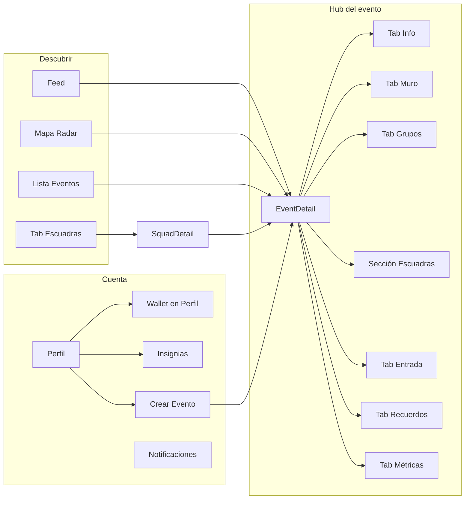

# EventUs — Especificación funcional y de vistas (handoff frontend)

> **Para diseño UX/UI completo (pantalla por pantalla, flujos F1–F20):** ver [`UX-UI-APPLICATION-MAP.md`](./UX-UI-APPLICATION-MAP.md)

> Documento para IA/diseñador que modelará el front.  
> **No define colores:** usar `DESIGN (1).md` + `getCommunityTheme(slug)` en código.  
> **Sí define:** vistas, flujos, acciones, API, estados, coherencia entre módulos.

**Backend:** listo (`/api/v1`). **Mobile:** parcial — este doc es la fuente de verdad para completar el producto de forma **cohesiva**.

---

## 0. Principio de coherencia (leer primero)

EventUs es **un solo producto** centrado en el **evento**. Todo debe sentirse conectado:

| Regla | Implicación |
|-------|-------------|
| **Hub único** | `EventDetailScreen` es el centro: inscripción, squads, muro, matchmaking, QR, álbum, métricas, WhatsApp viven ahí o salen de ahí |
| **Misma comunidad** | Todo evento tiene `metadata.communitySlug`; chip + tono visual siempre visibles en contexto de evento |
| **Mismo lenguaje** | "Inscribirme", "Escuadra", "Ir en grupo", "Mi entrada", "Invitar" — no mezclar términos legacy ("symposium", "salon") en UI nueva |
| **Mismos estados** | Loading / vacío / error / éxito en todas las listas y formularios |
| **Misma navegación** | Volver atrás siempre regresa al contexto anterior (Feed, Map, Squads, Events) |
| **Mismos permisos** | Si no estás inscrito → no muro ni QR; si no eres organizador → no métricas; si no eres líder → no aprobar squad |



---

## 1. Módulos del producto (qué hace cada uno)

### M1 — Autenticación y sesión

| Qué hace | Login, registro, sesión JWT, perfil básico, ubicación opcional |
| Store | `authStore` |
| Pantallas | `LoginScreen`, `RegisterScreen` |
| API | `POST /auth/login`, `POST /auth/register`, `GET /auth/me`, `PUT /auth/location` |

### M2 — Descubrimiento de eventos

| Qué hace | Feed curado, filtro por comunidad, eventos en vivo, acceso a detalle |
| Store | `eventStore`, `communityStore` |
| Pantallas | `FeedScreen` |
| API | `GET /events/explore`, `GET /communities` |

### M3 — Catálogo y calendario

| Qué hace | Lista completa de eventos (vista alternativa al feed) |
| Store | `eventStore` |
| Pantallas | `EventsScreen` |
| API | `GET /events/all` |

### M4 — Radar geolocalizado

| Qué hace | Mapa con eventos cercanos y personas online; tap → detalle evento |
| Store | `eventStore.fetchRadar` |
| Pantallas | `MapScreen` (nativo), `MapScreen.web` (mensaje “usa app móvil”) |
| API | `GET /events/radar?longitude&latitude&radius` |

### M5 — Detalle de evento (HUB)

| Qué hace | Orquesta todas las features del evento vía tabs/secciones |
| Store | `eventStore`, `squadStore`, **`eventusStore` (crear)** |
| Pantallas | `EventDetailScreen` + tabs embebidos (ver §4) |
| API | `GET /events/:id`, + endpoints eventus/squads según tab |

### M6 — Inscripción y entrada (QR dinámico)

| Qué hace | Registro al evento, ticket en wallet, QR con expiración ~90s y refresh |
| Store | `eventStore.registerForEvent`, `walletStore`, **`eventusStore.refreshQR`** |
| Pantallas | Modal en `EventDetail`, `DynamicQRTicketModal`, sección en `ProfileScreen` |
| API | `POST /events/register/:eventId`, `POST /eventus/events/:id/ticket/refresh`, `GET /users/wallet` |

### M7 — Escuadras (Squads)

| Qué hace | Grupos con cupo (ej. 4/5) para ir juntos al mismo evento; crear, unirse, aprobar, salir |
| Store | `squadStore` |
| Pantallas | `SquadsScreen`, `CreateSquadScreen`, **`SquadDetailScreen` (crear)**, strip en `EventDetail` |
| API | `/squads/*` |

### M8 — Matchmaking (grupos automáticos)

| Qué hace | Unirse a grupo por afinidad dentro del evento (distinto de squad manual) |
| Store | **`eventusStore` (crear)** |
| Pantallas | Tab **Grupos** dentro de `EventDetail` |
| API | `GET /eventus/events/:id/groups`, `POST .../groups/join` |

### M9 — Muro del evento

| Qué hace | Posts tipados: logística, icebreaker, preguntas, anuncios |
| Store | **`eventusStore` (crear)** |
| Pantallas | Tab **Muro** en `EventDetail` |
| API | `GET/POST /eventus/events/:id/wall` |

### M10 — Insignias e impacto

| Qué hace | Muro de badges del usuario + puntos de impacto |
| Store | **`eventusStore` (crear)** |
| Pantallas | Sección en `ProfileScreen` |
| API | `GET /eventus/badges/wall/:userId?` |

### M11 — Invitación WhatsApp

| Qué hace | Compartir evento por WhatsApp con mensaje prearmado |
| Pantallas | CTA fijo en tab **Info** de `EventDetail` |
| API | `GET /eventus/events/:id/invite/whatsapp` |

### M12 — Modo creador

| Qué hace | Publicar nueva iniciativa (evento) |
| Store | **`eventusStore.createEvent` (crear)** |
| Pantallas | **`CreateEventScreen`** (wizard) — entrada desde Feed FAB y Perfil |
| API | `POST /eventus/events` |

### M13 — Álbum colaborativo

| Qué hace | Galería post-evento; subir foto por URL |
| Store | **`eventusStore` (crear)** |
| Pantallas | Tab **Recuerdos** en `EventDetail` |
| API | `GET/POST /eventus/events/:id/album` |

### M14 — Métricas de organizador

| Qué hace | Dashboard solo para quien creó el evento |
| Store | **`eventusStore` (crear)** |
| Pantallas | Tab **Métricas** en `EventDetail` (condicional) |
| API | `GET /eventus/events/:id/metrics` |

### M15 — Notificaciones

| Qué hace | Alertas in-app (inscripción, squad lleno, etc.) |
| Store | **`notificationStore` (crear)** |
| Pantallas | **`NotificationsScreen`** + badge en headers |
| API | `GET /notifications`, `PATCH /notifications/read` |

### M16 — Mensajería (legacy rebrand)

| Qué hace | Chat 1:1 entre usuarios |
| Store | Llamadas directas o `messageStore` opcional |
| Pantallas | `MessagesScreen`, `ChatScreen` |
| API | `/messages/*` |

### M17 — Red / conexiones (opcional fase 3)

| Qué hace | Sugeridos, conexiones, salas discurso |
| Store | `networkStore` |
| Pantallas | **`NetworkScreen` (crear)** o sección en Perfil |
| API | `/network/*` |

---

## 2. Las 8 comunidades (solo datos funcionales)

Slug usado en API y filtros — **sin paleta aquí** (viene de `communityThemes.js`):

| Slug | Nombre UI | Cupo max matchmaking | Uso en UI |
|------|-----------|----------------------|-----------|
| `voluntariado` | Voluntariado | 12 | Filtro feed, chip evento |
| `benefico` | Benéfico | 8 | Idem |
| `quedada` | Quedada | 6 | Idem; squads tipo Pokémon GO |
| `reunion` | Reunión | 15 | Idem |
| `concierto` | Concierto | 8 | Idem |
| `deporte` | Deporte | 22 | Idem |
| `cultura` | Cultura | 10 | Idem |
| `medio_ambiente` | Medio ambiente | 30 | Idem |

Cada evento expone: `metadata.communitySlug`, `metadata.type`, `metadata.impactStatement`, `features.*` (flags on/off por feature).

---

## 3. Mapa de navegación definitivo

### 3.1 Sin sesión

```
LoginScreen ←→ RegisterScreen
```

### 3.2 Con sesión — Bottom tabs

| Tab | Stack | Rutas hijas |
|-----|-------|-------------|
| **Feed** | `FeedStack` | `FeedHome` → `EventDetail` → `CreateSquad` \| `CreateEvent` |
| **Mapa** | — | `MapHome` → `EventDetail` (modal o push) |
| **Escuadras** | `SquadsStack` **(crear stack)** | `SquadsHome` → `SquadDetail` → `CreateSquad` → `EventDetail` |
| **Eventos** | `EventStack` | `EventsHome` → `EventDetail` → … |
| **Mensajes** | `MessageStack` | `MessagesHome` → `Chat` |
| **Perfil** | `ProfileStack` **(crear stack)** | `ProfileHome` → `Notifications` \| `CreateEvent` \| `PublicProfile` |

### 3.3 Modales globales

| Modal | Se abre desde | Cierra a |
|-------|---------------|----------|
| `RegistrationConfirmModal` | EventDetail CTA inscribir | EventDetail |
| `DynamicQRTicketModal` | EventDetail tab Entrada, Profile wallet | Pantalla anterior |
| `SearchEventsModal` **(crear)** | Icono lupa Feed/Events | Lista resultados → EventDetail |

### 3.4 Header global (coherencia)

En **Feed, Events, Squads, Profile**: icono **campana** → `NotificationsScreen` (badge con no leídas).

---

## 4. Vistas — definición completa

Cada vista incluye: **propósito**, **entradas**, **API**, **contenido UI**, **acciones**, **estados**, **navegación salida**, **visibilidad**.

---

### V01 — `LoginScreen` ✅ existe

| Campo | Definición |
|-------|------------|
| Propósito | Autenticar usuario |
| Entradas | App cold start sin token |
| API | `POST /auth/login` |
| UI | Email, password, CTA, link registro, **dev:** línea `API: {config.API_URL}` |
| Acciones | Login → `MainTabs` |
| Estados | loading en botón, error inline |
| Salida | `MainTabs` o `RegisterScreen` |
| Coherencia | Mismo layout auth que Register (split visual) |

---

### V02 — `RegisterScreen` ✅ existe

| Campo | Definición |
|-------|------------|
| API | `POST /auth/register` body: email, password, firstName, lastName |
| UI | Form 4 campos + CTA |
| Salida | `MainTabs` automático tras éxito |

---

### V03 — `FeedScreen` ✅ existe — extender

| Campo | Definición |
|-------|------------|
| Propósito | Home: descubrir eventos, filtrar comunidad, ver live y squads abiertos |
| API | `GET /events/explore` (+ `?community=slug`), refresh pull |
| Secciones UI (orden fijo) | 1) Header + búsqueda 2) `CommunityFilterBar` 3) `LiveSalonsGallery` si hay live 4) `SquadsStrip` global (openSquads del explore) 5) `CuratedFeed` eventos |
| Acciones | Tap evento → `EventDetail`; tap squad → `SquadDetail` o join rápido; **FAB (+)** → `CreateEvent`; lupa → `SearchEventsModal` |
| Estados | skeleton feed, vacío “no hay eventos en esta comunidad”, error retry |
| Coherencia | Mismo `EventCard` que en EventsScreen |

---

### V04 — `EventsScreen` ✅ existe

| Campo | Definición |
|-------|------------|
| Propósito | Vista lista/calendario de todos los eventos |
| API | `GET /events/all` |
| UI | Lista agrupada por fecha; chip comunidad en cada card |
| Acciones | Tap → `EventDetail` |
| Coherencia | Card idéntica a Feed |

---

### V05 — `MapScreen` ✅ existe — extender

| Campo | Definición |
|-------|------------|
| Propósito | Radar: eventos y personas cerca |
| API | `GET /events/radar` tras `expo-location` permiso |
| UI | Mapa + pins eventos + pins usuarios online + **panel inferior** lista (evento / persona) |
| Acciones | Tap pin evento → `EventDetail`; tap persona → `PublicProfile` o “Conectar” |
| Estados | sin permiso GPS → CTA activar; sin resultados → “Nada cerca, amplía radio” |
| Actualizar | `PUT /auth/location` al moverse (opcional throttle) |

---

### V06 — `EventDetailScreen` ⚠️ HUB — reestructurar obligatorio

| Campo | Definición |
|-------|------------|
| Propósito | **Centro del producto** — toda acción sobre un evento |
| Entradas | Feed, Events, Map, SquadDetail, CreateEvent éxito, notificación deep link |
| API inicial | `GET /events/:id` → `{ event, community, squads }` |
| Layout | Header comunidad + título + impacto \| **Tab bar interno** \| Contenido tab \| **CTA sticky** según contexto |

#### Tabs internos (definición de done)

| Tab | ID | Visible si | Contenido | API adicional |
|-----|-----|------------|-----------|---------------|
| **Info** | `info` | siempre | Descripción, fecha/lugar, hosts, speakers, capacidad, features habilitadas, CTA WhatsApp, CTA Inscribir | WhatsApp GET |
| **Muro** | `wall` | `features.wallEnabled` | Lista posts + composer | GET/POST wall |
| **Grupos** | `groups` | `features.matchmakingEnabled` | MatchGroups + CTA Unirme | GET/POST groups |
| **Escuadras** | `squads` | siempre (evento con squads) | `SquadsStrip` del evento + crear | squads/open?eventId |
| **Entrada** | `ticket` | usuario inscrito | QR + countdown + refresh | refresh QR |
| **Recuerdos** | `album` | `features.albumEnabled` | Grid fotos + subir | GET/POST album |
| **Métricas** | `metrics` | `user._id === event.createdBy` | Dashboard stats | GET metrics |

#### CTAs sticky por estado usuario

| Estado | CTA principal |
|--------|----------------|
| No inscrito | **Inscribirme** → `RegistrationConfirmModal` |
| Inscrito | **Ver mi entrada** → tab Entrada |
| Organizador | **Ver métricas** → tab Métricas |
| Siempre | **Invitar** (WhatsApp) en tab Info |

#### Flags `event.features` — ocultar tabs apagados

No mostrar tab si `features.xxxEnabled === false`.

---

### V07 — `RegistrationConfirmModal` ✅ existe

| Campo | Definición |
|-------|------------|
| API | `POST /events/register/:eventId` |
| Resultado | `ticket` → `walletStore.addTicket` + snack éxito + ofrecer abrir QR |
| Error | cupo lleno, ya registrado |

---

### V08 — `DynamicQRTicketModal` ❌ crear

| Campo | Definición |
|-------|------------|
| Propósito | Mostrar entrada antifraude |
| Entradas | Tab Entrada, Wallet tap |
| UI | QR image (`qrDataUrl`), timer `ttlSeconds`, texto “Se renueva cada X s”, botón manual refresh |
| API | `POST /eventus/events/:eventId/ticket/refresh` |
| Lógica | Interval countdown; al llegar 0 → auto-refresh; loading durante refresh |
| Estados | sin ticket → “Inscríbete primero” |

---

### V09 — `SquadsScreen` ⚠️ extender

| Campo | Definición |
|-------|------------|
| Propósito | Explorar y gestionar escuadras |
| API | Tab A: `GET /squads/open` — Tab B: `GET /squads/my` |
| UI | Segmented control **Abiertas \| Mis escuadras**; lista `SquadCard` |
| Acciones | Tap card → `SquadDetail`; FAB → `CreateSquad` (selector evento si no hay contexto) |
| Coherencia | Misma card que en EventDetail strip |

---

### V10 — `SquadDetailScreen` ❌ crear

| Campo | Definición |
|-------|------------|
| API | `GET /squads/:squadId` |
| UI | Nombre, plan, evento linked (tap → EventDetail), lista miembros con rol/estado, cupos `activeCount/maxSize`, meeting point |
| Acciones | Unirse (si cupo), Salir (si miembro), Aprobar (si líder y pending), Invitar vía WhatsApp del evento |
| Estados | full → badge “Llena”; recruiting → “Faltan N” |
| Salida | EventDetail del evento vinculado |

---

### V11 — `CreateSquadScreen` ✅ existe

| Campo | Definición |
|-------|------------|
| API | `POST /squads` |
| Campos | name, plan (required), maxSize (default 5), activityTag, planNote, joinPolicy |
| Params ruta | `eventId`, `eventTitle`, `communitySlug` prellenados desde EventDetail |
| Salida | Éxito → `SquadDetail` o back a EventDetail con refresh |

---

### V12 — `CreateEventScreen` ❌ crear (wizard)

| Campo | Definición |
|-------|------------|
| Propósito | Modo creador — publicar evento |
| API | `POST /eventus/events` |
| Pasos | 1) Comunidad (slug) 2) Título + descripción + impacto 3) Fecha y horas 4) Lugar (venue + mapa opcional) 5) Cupo max + toggles features 6) Resumen + publicar |
| Validación | Espejar `createEventRules` backend |
| Salida | `EventDetail` del evento creado |
| Coherencia | Mismo picker comunidad que filtro Feed |

---

### V13 — `ProfileScreen` ⚠️ extender

| Campo | Definición |
|-------|------------|
| API | `GET /auth/me`, `GET /users/wallet`, `GET /eventus/badges/wall` |
| Secciones (orden) | 1) `IdentityHeader` 2) Métricas impacto (`AcademicMetrics` renombrado) 3) **Insignias** (`BadgeWall`) 4) **Wallet** (`DigitalWallet` → abre QR) 5) Idioma 6) Cerrar sesión |
| Acciones | FAB o fila **Crear evento** → `CreateEvent`; campana → Notifications |
| Coherencia | Métricas = impactPoints, eventsAttended, eventsCreated, invitesSent |

---

### V14 — `NotificationsScreen` ❌ crear

| Campo | Definición |
|-------|------------|
| API | `GET /notifications`, `PATCH /notifications/read` |
| UI | Lista por fecha; tipos: event_register, squad_full, squad_join, etc. |
| Acciones | Tap → deep link (`EventDetail`, `SquadDetail`) según payload |
| Estados | vacío “Estás al día” |

---

### V15 — `MessagesScreen` + `ChatScreen` ⚠️ rebrand

| Campo | Definición |
|-------|------------|
| Mantener funcionalidad | lista conversaciones + chat |
| Coherencia | Copy EventUs; avatares; sin terminología Atelier |

---

### V16 — `SearchEventsModal` ❌ crear (opcional Fase 1)

| Campo | Definición |
|-------|------------|
| API | `GET /events/explore?search=` o filtrar client-side |
| UI | Input + resultados → EventDetail |

---

## 5. Componentes — catálogo funcional (sin estilos)

| Componente | Responsabilidad | Usado en |
|------------|-----------------|----------|
| `EventCard` | Título, comunidad, fecha, cupos, live badge | Feed, Events, Search |
| `CommunityChip` | Slug + nombre comunidad | EventCard, EventDetail header |
| `CommunityFilterBar` | Filtro horizontal 8 comunidades + “Todas” | Feed |
| `EventFeatureTabs` | Tabs del hub EventDetail | EventDetail |
| `CapacityIndicator` | `current/max` + barra | EventCard, EventDetail |
| `ImpactBanner` | `impactStatement` | EventDetail Info |
| `HostList` / `KeynoteList` | Organizadores y speakers | EventDetail Info |
| `WallPostList` + `WallPostComposer` | Muro | Tab Muro |
| `MatchGroupList` + `JoinGroupButton` | Matchmaking | Tab Grupos |
| `SquadsStrip` + `SquadCard` | Escuadras | Feed, EventDetail, Squads |
| `DynamicQRTicket` | QR + timer + refresh | Modal, tab Entrada |
| `DigitalWallet` | Lista tickets | Profile |
| `BadgeWall` | Grid insignias + puntos | Profile |
| `OrganizerMetricsPanel` | Cards métricas | Tab Métricas |
| `AlbumGrid` + `AddPhotoForm` | Álbum (URL + caption) | Tab Recuerdos |
| `WhatsAppShareButton` | CTA invitar | EventDetail Info |
| `NotificationBell` | Icono + badge count | Headers |
| `EmptyState` | Icono + mensaje + acción | Global |
| `ErrorState` | Mensaje + retry | Global |
| `RegistrationAction` | CTA inscribir | EventDetail |
| `NearbyEventsPanel` | Lista bajo mapa | MapScreen |
| `CreateEventStepper` | Indicador pasos wizard | CreateEvent |

**Componente a deprecar visualmente:** `EventUsFeatures` (pills decorativas sin acción) → reemplazar por tabs reales o eliminar.

---

## 6. Stores — contrato único

### Existentes (extender)

```text
authStore       → login, register, fetchMe, logout, user, token
eventStore      → explore, event detail, register, radar, filter
squadStore      → open, my, create, join, leave
walletStore     → fetchWallet, addTicket
communityStore  → fetchCommunities
languageStore   → es | en
networkStore    → opcional
```

### Crear `eventusStore` (obligatorio para cohesión)

```text
fetchWall(eventId)           → GET wall
postWall(eventId, content, type)
fetchMatchGroups(eventId)    → GET groups
joinMatchmaking(eventId)     → POST join
fetchAlbum(eventId)          → GET album
postAlbumPhoto(eventId, url, caption)
fetchMetrics(eventId)        → GET metrics (manejar 403)
refreshTicketQR(eventId)     → POST refresh
fetchBadgeWall(userId?)      → GET badges
createEvent(payload)         → POST eventus/events
getWhatsAppInvite(eventId)   → GET whatsapp
```

### Crear `notificationStore`

```text
fetchNotifications()
markAllRead()
unreadCount                  → derivado para campana
```

---

## 7. API — referencia rápida (sin cambiar)

Base: `{EXPO_PUBLIC_API_URL}` = `.../api/v1`  
Header: `Authorization: Bearer {token}`  
Ngrok: `ngrok-skip-browser-warning: true`

| Dominio | Endpoints críticos |
|---------|-------------------|
| Auth | login, register, me, location |
| Events | explore, :id, register/:eventId, radar, all |
| Eventus | events POST, wall, groups, album, metrics, ticket/refresh, whatsapp, badges/wall |
| Squads | open, my, :id, POST, join, leave, approve |
| Users | wallet, profile |
| Notifications | GET, PATCH read |
| Messages | /, :userId, POST |
| Network | suggested-nodes, connections, connect |

Detalle request/response: ver código en `backend/controllers/` y `FRONTEND-BRIEF` histórico en git si hace falta campo a campo.

---

## 8. Reglas de visibilidad (coherencia de permisos)

| Elemento | Condición |
|----------|-----------|
| Tab Muro | `features.wallEnabled` + usuario inscrito |
| Tab Entrada / QR | usuario en `event.attendees` o tiene ticket en wallet |
| Tab Métricas | `user._id === event.createdBy` |
| Tab Recuerdos | `features.albumEnabled` (ideal: fecha evento pasada o siempre si album abierto) |
| Composer muro | inscrito |
| Aprobar squad | `squad.leader === user._id` |
| Crear evento | cualquier autenticado |
| Matchmaking join | no estar ya en otro grupo del mismo evento (error backend) |

---

## 9. Estados UX obligatorios (todas las vistas)

Cada pantalla y tab debe implementar:

| Estado | Comportamiento |
|--------|----------------|
| **Loading** | Skeleton o spinner centrado primera carga |
| **Refreshing** | Pull-to-refresh donde hay lista |
| **Empty** | `EmptyState` con acción contextual |
| **Error** | Mensaje humano + botón Reintentar |
| **Success feedback** | Toast/Alert breve tras acciones POST |
| **Offline** | Mensaje “Sin conexión” si `error.response` ausente |

---

## 10. Definición de “todo funciona a la vez”

Checklist de producto completo — **Definition of Done**:

- [ ] Usuario puede registrarse, login, ver feed filtrado por comunidad
- [ ] Usuario abre evento y ve **todos los tabs** que aplican según `features` y su rol
- [ ] Usuario se inscribe y ve QR con **countdown + refresh**
- [ ] Usuario publica en muro y ve posts de otros
- [ ] Usuario entra a matchmaking y aparece en un grupo
- [ ] Usuario crea escuadra, otro se une, líder aprueba si `approval`
- [ ] Usuario invita por WhatsApp
- [ ] Usuario ve insignias y wallet en perfil
- [ ] Creador publica evento y ve métricas en su evento
- [ ] Usuario sube foto al álbum (URL)
- [ ] Mapa muestra eventos y usuarios; tap lleva a detalle
- [ ] Notificaciones listan y marcan leídas; campana con contador
- [ ] Mensajes siguen funcionando con copy EventUs
- [ ] i18n ES/EN en strings nuevas
- [ ] Misma card de evento en Feed y Events
- [ ] Volver atrás nunca deja pantallas huérfanas

---

## 11. Qué existe vs qué construir

| Vista / pieza | Estado |
|---------------|--------|
| V01–V02 Auth | ✅ |
| V03 Feed | ✅ extender FAB + búsqueda |
| V04 Events | ✅ |
| V05 Map | ✅ extender panel inferior |
| V06 EventDetail tabs | ❌ **crítico** |
| V07 Registration modal | ✅ |
| V08 QR modal | ❌ |
| V09–V11 Squads | ⚠️ falta V10 Detail |
| V12 Create event | ❌ |
| V13 Profile badges/wallet QR | ⚠️ |
| V14 Notifications | ❌ |
| V15 Messages | ⚠️ copy |
| eventusStore | ❌ |
| notificationStore | ❌ |
| EventFeatureTabs | ❌ |

---

## 12. i18n y copy coherente

Archivo: `mobile/src/i18n/translations.js`

Nuevas claves sugeridas (ES/EN):

- Tabs: `event.tab.info`, `event.tab.wall`, `event.tab.groups`, `event.tab.squads`, `event.tab.ticket`, `event.tab.album`, `event.tab.metrics`
- Acciones: `action.register`, `action.invite`, `action.joinSquad`, `action.createSquad`, `action.refreshQR`
- Vacíos: `empty.wall`, `empty.groups`, `empty.album`, `empty.notifications`

**No usar en UI nueva:** symposium, salon, atelier, credentials académicas como foco principal.

---

## 13. Restricciones técnicas (integración)

| Restricción | Motivo |
|-------------|--------|
| No `react-native-reanimated` | Rompe Expo Go |
| Usar `getCommunityTheme(slug)` | Temas por comunidad ya en código |
| Estilos base `theme/tokens.js` + `DESIGN (1).md` | Colores no se inventan en brief |
| Álbum: POST con `{ url }` | Backend no tiene multipart |
| Expo Go | Probar con tunnel + ngrok |
| `mobile/.env` | `EXPO_PUBLIC_API_URL=.../api/v1` |

---

## 14. Datos demo

| Email | Password | Uso |
|-------|----------|-----|
| `demo@eventus.app` | `demo123` | Usuario estándar |
| `sofia.impacto@eventus.pe` | `demo123` | Organizadora |
| `mateo.social@eventus.pe` | `demo123` | Creador quedadas |

Seed: 8 eventos (1 por comunidad), Squad **Poké-Kennedy** 4/5 en evento quedada.

---

## 15. Orden de construcción (para IA + dev)

**Bloque 1 — Hub cohesivo**  
`EventFeatureTabs` + refactor `EventDetailScreen` + `eventusStore` + tab Info/Wall/Groups/Ticket

**Bloque 2 — Participación**  
`DynamicQRTicketModal` + Wallet integration + `SquadDetailScreen`

**Bloque 3 — Creador**  
`CreateEventScreen` + tab Métricas + tab Recuerdos

**Bloque 4 — Cuenta y sistema**  
`BadgeWall` + `NotificationsScreen` + campana global + Map panel

**Bloque 5 — Pulido**  
Search, Messages rebrand, Network opcional

---

## 16. Entregables esperados de la IA de diseño

1. Wireframe **V06 EventDetail** con 7 tabs y CTAs por estado  
2. Flujo Figma/link: Feed → Detail → Inscripción → QR  
3. Flujo: Detail → Squad → Detail evento  
4. Pantallas V08, V10, V12, V14 en empty/loading/error  
5. Mapa navegación alineado a §3  
6. **Sin** paleta hex en entregables — referenciar “tema comunidad X” y `DESIGN (1).md`

---

*EventUs API v2.0.0 — Expo SDK 54 — Documento funcional v2 (cohesión y vistas).*
