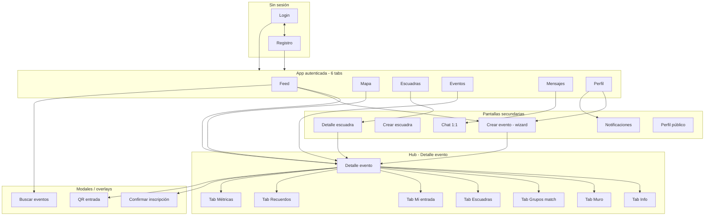

# EventUs — Mapa completo UX/UI de la aplicación

> **Para:** IA o diseñador UX/UI que modelará toda la interfaz.  
> **Objetivo:** Trazar **toda** la app de punta a punta para que **todas** las funcionalidades del backend tengan pantalla, flujo y estados coherentes.  
> **No incluye:** paletas hex ni estilos finales → ver `DESIGN (1).md` y temas por comunidad en código.

---

## A. Resumen ejecutivo

**EventUs** es una app móvil (Expo / React Native) para descubrir eventos con impacto social, inscribirse, ir en grupo (escuadras o matchmaking), entrar con QR dinámico, participar en el muro del evento, ganar insignias e invitar por WhatsApp. Los organizadores publican eventos y ven métricas.

**Centro de la experiencia:** la pantalla **Detalle del evento**, con pestañas internas. Todo lo que ocurre “en un evento” vive ahí o llega ahí desde descubrimiento (Feed, Mapa, Lista, Escuadras).

**Usuario demo:** `demo@eventus.app` / `demo123`

---

## B. Mapa de la aplicación (sitemap)



---

## C. Navegación global (patrones UX)

### C.1 Barra inferior (6 tabs — siempre visible salvo modales fullscreen)

| Orden | Etiqueta | Icono sugerido | Rol |
|-------|----------|----------------|-----|
| 1 | Inicio | brújula / casa | Feed descubrimiento |
| 2 | Mapa | mapa | Radar geográfico |
| 3 | Escuadras | personas | Squads abiertos y propios |
| 4 | Eventos | calendario | Lista completa |
| 5 | Mensajes | chat | Conversaciones |
| 6 | Perfil | persona | Cuenta, wallet, insignias |

### C.2 Header recurrente (en tabs principales)

- Título de sección (izquierda)
- **Campana notificaciones** (derecha) → pantalla Notificaciones; badge si hay no leídas
- En Feed: además **lupa** → búsqueda eventos

### C.3 FAB (botón flotante)

- **Feed:** “+” → Crear evento (modo creador)
- **Escuadras (opcional):** “+” → Crear escuadra (elige evento si no hay contexto)

### C.4 Reglas de retroceso

- Flecha atrás = pantalla anterior en el stack
- Desde Detalle evento → vuelve a Feed / Mapa / Eventos / Escuadra según origen
- Modales: cerrar (X) o gesto swipe down

### C.5 Identidad por comunidad (coherencia visual)

En **cualquier** pantalla ligada a un evento:

- Chip visible: nombre comunidad (Voluntariado, Quedada, etc.)
- Tono visual deriva del slug (implementación: tema en código, no definir aquí)

---

## D. Inventario de pantallas (26 superficies)

| ID | Pantalla | Tipo | Prioridad diseño |
|----|----------|------|------------------|
| P01 | Login | Auth | Alta |
| P02 | Registro | Auth | Alta |
| P03 | Feed (Inicio) | Tab | Alta |
| P04 | Buscar eventos | Modal | Media |
| P05 | Mapa / Radar | Tab | Alta |
| P06 | Lista eventos | Tab | Alta |
| P07 | Detalle evento (shell + tabs) | Hub | **Crítica** |
| P08 | Tab Info (dentro P07) | Tab interno | Crítica |
| P09 | Tab Muro | Tab interno | Crítica |
| P10 | Tab Grupos (matchmaking) | Tab interno | Crítica |
| P11 | Tab Escuadras (en evento) | Tab interno | Alta |
| P12 | Tab Mi entrada (QR) | Tab interno | Crítica |
| P13 | Tab Recuerdos (álbum) | Tab interno | Alta |
| P14 | Tab Métricas (organizador) | Tab interno | Alta |
| P15 | Modal confirmar inscripción | Modal | Alta |
| P16 | Modal QR entrada | Modal | Crítica |
| P17 | Escuadras (tab principal) | Tab | Alta |
| P18 | Detalle escuadra | Push | Alta |
| P19 | Crear escuadra | Push | Alta |
| P20 | Crear evento (wizard 6 pasos) | Push | Alta |
| P21 | Perfil | Tab | Alta |
| P22 | Notificaciones | Push | Media |
| P23 | Mensajes (lista) | Tab | Media |
| P24 | Chat | Push | Media |
| P25 | Perfil público (otro usuario) | Push | Baja |
| P26 | Mapa web (stub) | Tab web | Baja |

---

## E. Especificación pantalla por pantalla

---

### P01 — Login

**Objetivo UX:** Entrar rápido; confiar en la app.

**Layout:**

```
[Logo / marca EventUs]
[Tagline corta]
[Campo email]
[Campo contraseña]
[Botón primario: Acceder]
[Link: Crear cuenta]
(opcional dev: texto pequeño URL API)
```

**Interacciones:**

- Tap Acceder → loading en botón → éxito: entra a app (tabs) / error: mensaje bajo campos
- Tap Crear cuenta → P02

**Estados:** vacío validación inline; error credenciales; sin conexión

**Copy sugerido ES:** “Conecta con propósito” / “Acceder a la plataforma”

---

### P02 — Registro

**Objetivo UX:** Alta mínima (4 campos).

**Layout:**

```
[Atrás]
[Nombre] [Apellido]
[Email]
[Contraseña]
[Botón: Crear cuenta]
[Link: Ya tengo cuenta]
```

**Éxito:** entra directo a Feed (sesión iniciada).

---

### P03 — Feed (Inicio)

**Objetivo UX:** Descubrir qué hacer hoy cerca y por comunidad.

**Layout (scroll vertical, orden fijo):**

```
[Header: "Descubrir" + lupa + campana]
[Barra filtros: Todas | Voluntariado | Benéfico | ... 8 chips scroll horizontal]
[Sección EN VIVO - carrusel horizontal si hay eventos isLive]
[Sección ESCUADRAS ABIERTAS - carrusel cards 4/5 cupos]
[Sección PARA TI - lista vertical EventCard]
[FAB + crear evento]
[Tab bar]
```

**EventCard (componente repetido en Feed y P06):**

- Chip comunidad
- Título evento
- Fecha + hora + lugar (1 línea)
- Barra cupos: “34 / 80 lugares”
- Badge “EN VIVO” si aplica
- Tap → P07

**SquadsStrip card:**

- Nombre escuadra, evento padre, “4/5” avatares, CTA “Ver” / “Unirme”

**Interacciones:**

- Pull to refresh
- Tap filtro comunidad → recarga lista
- FAB → P20
- Lupa → P04

**Estados vacíos:**

- Sin eventos en comunidad: ilustración + “Prueba otra comunidad” + CTA ver todas
- Sin escuadras: ocultar sección

---

### P04 — Buscar eventos (modal)

**Objetivo UX:** Encontrar evento por texto.

**Layout:**

```
[Input búsqueda autofocus]
[Lista resultados = mismas EventCard]
[Cerrar]
```

**Sin resultados:** “No encontramos eventos con ese nombre”

---

### P05 — Mapa / Radar

**Objetivo UX:** Ver qué hay cerca en el mapa; decidir ir.

**Layout:**

```
[Mapa pantalla completa - estilo oscuro]
[Pin eventos - tap abre preview sheet]
[Pin usuarios online - otro estilo pin]
[Panel inferior deslizable - 30% altura]
  - Tab segmentado: Eventos | Personas
  - Lista cards compactas
[Botón centrar en mi ubicación]
[Tab bar]
```

**Preview sheet (tap pin evento):**

- Mini card evento + CTA “Ver evento” → P07

**Permiso GPS denegado:**

- Overlay: “Activa ubicación para ver el radar” + CTA ir a ajustes

**Interacciones:**

- Mover mapa → recargar radar (debounce)
- Tap card lista → P07 o P25

---

### P06 — Lista eventos

**Objetivo UX:** Vista tipo agenda de todo lo programado.

**Layout:**

```
[Header: "Eventos" + campana]
[Lista agrupada por fecha (Hoy, Mañana, Esta semana...)]
[Misma EventCard que Feed]
[Tab bar]
```

**Diferencia con Feed:** sin carrusel live prioritario; orden cronológico estricto.

---

### P07 — Detalle del evento (contenedor / shell)

**Objetivo UX:** Un solo lugar para entender, inscribirse y participar.

**Layout fijo:**

```
[Barra superior: ← atrás | compartir (WhatsApp)]
[Hero: chip comunidad + tipo + título + frase impacto]
[Barra cupos + fecha + lugar - iconos]
[Tabs horizontales scroll]
[Área contenido = tab activo - scroll]
[Barra inferior STICKY - CTA según estado usuario]
```

**Tabs (mostrar solo si feature activa en evento):**

| Tab | Label UI | Visible cuando |
|-----|----------|----------------|
| Info | Info | siempre |
| Muro | Muro | feature wall |
| Grupos | Ir en grupo | feature matchmaking |
| Escuadras | Escuadras | siempre |
| Entrada | Mi entrada | usuario inscrito |
| Recuerdos | Recuerdos | feature album |
| Métricas | Métricas | usuario es organizador |

**Barra sticky CTAs:**

| Situación usuario | CTA primario | Secundario |
|-------------------|--------------|------------|
| No inscrito | Inscribirme | Invitar |
| Inscrito | Ver mi entrada | Invitar |
| Organizador | Ver métricas | Invitar |
| Cupo lleno | Lista de espera (deshabilitado) o solo Invitar | — |

**Contenido de cada tab → P08–P14**

---

### P08 — Tab Info (dentro Detalle evento)

**Contenido scroll:**

```
[Banner impacto - metadata.impactStatement]
[Bloque Descripción]
[Bloque Cuándo / Dónde - mapa mini opcional]
[Bloque Organizadores - avatares + nombres]
[Bloque Speakers si hay]
[Lista features activas - iconos: Radar, QR, Muro, etc.]
[Bloque Invitar - botón WhatsApp grande]
```

**WhatsApp:** tap → abre app WhatsApp con mensaje precargado (API).

---

### P09 — Tab Muro

**Objetivo UX:** Coordinación pre/durante evento; romper hielo.

**Layout:**

```
[Filtro tipo post: Todos | Logística | Icebreaker | Pregunta | Anuncio]
[Lista posts - más reciente arriba]
  Cada post: avatar, nombre, badge tipo, tiempo, texto
[Composer fijo abajo - solo si inscrito]
  [Selector tipo] [Input multilínea] [Enviar]
```

**No inscrito:** composer oculto; banner “Inscríbete para participar en el muro”

**Post vacío:** “Sé el primero en escribir” + sugerencias icebreaker

**Tipos post (labels):** General, Logística, Rompehielos, Pregunta, Anuncio

---

### P10 — Tab Grupos (matchmaking)

**Objetivo UX:** No ir solo; el sistema agrupa por afinidad.

**Layout:**

```
[Texto explicativo: "Te asignamos un grupo según intereses"]
[Lista grupos existentes]
  Card grupo: nombre, X/Y miembros, avatares, estado Formando/Listo
[Botón fijo: Unirme a un grupo]
```

**Tras unirse:** card resaltada “Tu grupo” + lista miembros con % afinidad (opcional)

**Error ya en grupo:** mensaje claro

**Vacío:** solo CTA Unirme (crea primer grupo)

---

### P11 — Tab Escuadras (en evento)

**Objetivo UX:** Plan concreto con gente (ej. mismo juego, mismo transporte).

**Layout:**

```
[Texto: "Arma tu plan e invita amigos"]
[Carrusel o lista SquadCard]
  - nombre, plan 1 línea, 4/5, tag actividad
[Botón: Crear escuadra para este evento]
```

**Tap card** → P18  
**Crear** → P19 con evento preseleccionado

---

### P12 — Tab Mi entrada

**Objetivo UX:** Mostrar QR que caduca; antifraude.

**Layout (inscrito):**

```
[Tarjeta entrada: nombre evento, fecha, venue]
[QR grande centrado]
[Countdown: "Se renueva en 0:45"]
[Texto ayuda: "Muestra este código en el acceso"]
[Botón: Actualizar código]
```

**Countdown llega a 0:** auto-refresh visual + nuevo QR

**No inscrito:** redirect visual a CTA Inscribirme del sticky

---

### P13 — Tab Recuerdos (álbum colaborativo)

**Objetivo UX:** Compartir fotos post-evento.

**Layout:**

```
[Grid 3 columnas fotos]
[Cada celda: imagen + mini avatar quien subió]
[FAB o botón: Añadir foto]
```

**Flujo añadir:**

1. Elegir imagen (galería)
2. Subir a hosting (fuera de app) → obtener URL
3. Pantalla mini: preview + caption opcional
4. Publicar → aparece en grid

**Vacío:** “Aún no hay recuerdos. Sé el primero.”

**Álbum cerrado (si API):** mensaje “El álbum ya cerró”

---

### P14 — Tab Métricas (solo organizador)

**Objetivo UX:** Entender rendimiento del evento.

**Layout dashboard:**

```
[Título evento + chip comunidad]
[Grid 2 columnas tarjetas métrica]
  - Vistas
  - Inscripciones
  - Check-ins
  - Compartidos WhatsApp
  - Posts en muro
  - Grupos formados
  - Fotos en álbum
[Barra grande: % cupo llenado]
[Bloque impacto: meta, beneficiarios]
```

**No organizador:** tab no visible (no mostrar nunca)

---

### P15 — Modal confirmar inscripción

**Trigger:** CTA Inscribirme en P07.

**Layout:**

```
[Título: Confirmar inscripción]
[Resumen: evento, fecha, lugar]
[Texto: recibirás entrada con QR dinámico]
[Botón: Confirmar] [Cancelar]
```

**Éxito:** cierra modal → snack “¡Inscrito!” → sugerir “Ver mi entrada” (cambia tab o abre P16)

**Errores:** cupo lleno, ya inscrito

---

### P16 — Modal QR entrada (alternativa a tab)

**Mismo contenido que P12** pero modal fullscreen desde Wallet en Perfil.

**Cerrar:** X → vuelve a Perfil

---

### P17 — Escuadras (tab principal)

**Objetivo UX:** Ver todas las escuadras abiertas y las mías.

**Layout:**

```
[Header: Escuadras + campana]
[Segmented: Abiertas | Mis escuadras]
[Lista SquadCard completa]
[FAB crear - opcional]
[Tab bar]
```

**Abiertas:** squads con cupo disponible, orden actualizado  
**Mis escuadras:** donde soy líder o miembro activo

**Tap** → P18

---

### P18 — Detalle escuadra

**Layout:**

```
[← Atrás]
[Nombre escuadra]
[Tag actividad + estado: Reclutando / Llena / En camino]
[Card evento vinculado - tap → P07]
[Sección Plan - texto completo]
[Punto encuentro]
[Lista miembros]
  - avatar, nombre, rol, nota plan, badge pendiente si approval
[Barra cupos visual 4/5]
[CTA zona inferior según rol]
```

**CTAs por rol:**

| Rol | CTA |
|-----|-----|
| Visitante | Unirme al plan |
| Miembro | Salir de escuadra |
| Líder | Aprobar solicitudes (lista pending) + Invitar |
| Llena | Botón deshabilitado “Escuadra llena” |

---

### P19 — Crear escuadra

**Layout formulario:**

```
[Atrás]
[Título: Nueva escuadra]
[Evento - prellenado si viene de P07]
[Nombre escuadra *]
[Plan - qué harán juntos * - textarea]
[Tamaño máximo - stepper 2-30, default 5]
[Tag actividad - chips: general, pokemon-go, transporte...]
[Política: Abierta | Requiere aprobación]
[Nota personal opcional]
[Botón: Crear escuadra]
```

**Éxito:** → P18 o back P07 tab Escuadras

---

### P20 — Crear evento (wizard 6 pasos)

**Objetivo UX:** Publicar iniciativa sin fricción; coherente con comunidades.

**Stepper superior:** 1 Comunidad → 2 Detalle → 3 Fecha → 4 Lugar → 5 Cupo → 6 Publicar

**Paso 1 — Comunidad:** grid 8 tarjetas (icono + nombre + tagline)  
**Paso 2 — Detalle:** título, descripción, frase impacto  
**Paso 3 — Fecha:** date picker, hora inicio/fin  
**Paso 4 — Lugar:** nombre venue, dirección, mapa pin opcional  
**Paso 5 — Cupo:** número máximo; toggles features (muro, QR, matchmaking, álbum, WhatsApp)  
**Paso 6 — Resumen:** preview card + botón Publicar

**Éxito:** → P07 del evento nuevo (organizador ve tab Métricas)

---

### P21 — Perfil

**Objetivo UX:** Identidad, logros, entradas, configuración.

**Layout scroll:**

```
[Header: Mi perfil + campana]
[IdentityHeader: avatar, nombre, bio, título]
[Sección Impacto - 4 números: eventos asistidos, creados, puntos, invitaciones]
[Sección Insignias - grid horizontal + ver todas]
[Sección Mis entradas - DigitalWallet cards]
  tap entrada → P16 QR
[Sección Crear evento - fila CTA → P20]
[Sección Idioma ES | EN]
[Cerrar sesión - texto destructivo]
[Tab bar]
```

---

### P22 — Notificaciones

**Layout:**

```
[← Notificaciones]
[Marcar todas leídas]
[Lista agrupada Hoy / Antes]
  Item: icono tipo, título, cuerpo, tiempo, punto no leído
```

**Tipos y destino tap:**

| Tipo | Al tap |
|------|--------|
| Inscripción confirmada | P07 |
| Escuadra casi llena | P18 |
| Solicitud aprobada | P18 |
| Nuevo en grupo | P07 tab Grupos |

**Vacío:** “No tienes notificaciones”

---

### P23 — Mensajes

**Layout estándar chat app:**

```
[Header: Mensajes]
[Lista conversaciones: avatar, nombre, último mensaje, hora, badge no leído]
[Tab bar]
```

**Tap** → P24

---

### P24 — Chat

**Layout:**

```
[← Nombre usuario]
[Burbujas mensajes scroll]
[Input + enviar]
```

---

### P25 — Perfil público

**Para:** tap usuario en mapa o lista.

**Layout:** similar a P21 sin wallet/settings; botón “Enviar mensaje” → P24

---

### P26 — Mapa web (solo Expo Web)

**Mensaje:** “El radar está disponible en la app móvil” + QR descargar Expo Go

---

## F. Flujos de usuario (trazado completo)

Cada flujo debe poder probarse con la cuenta demo y backend + ngrok.

---

### F1 — Primera vez en la app

```
P01 Login → credenciales → P03 Feed
```

---

### F2 — Registro

```
P01 → P02 → completar → P03 Feed
```

---

### F3 — Descubrir e inscribirse (flujo núcleo)

```
P03 Feed
  → tap EventCard
  → P07 Detalle (tab Info por defecto)
  → leer impacto + descripción
  → tap Inscribirme (sticky)
  → P15 Modal confirmar
  → éxito
  → P12 Tab entrada (QR + countdown)
  → opcional P16 desde P21 Wallet
```

---

### F4 — Filtrar por comunidad

```
P03 → chip "Quedada" → lista filtrada
  → tap evento → P07 con chip Quedada visible
```

---

### F5 — Radar y llegar al evento

```
P05 Mapa → permitir GPS
  → ver pins → tap evento
  → preview → P07
  → Inscribirme (F3)
```

---

### F6 — Invitar por WhatsApp

```
P07 → tab Info → Invitar por WhatsApp
  → sale de app → WhatsApp con mensaje + código + deep link
  → vuelve a EventUs
```

---

### F7 — Escuadra desde evento (Pokémon 4/5)

```
P07 → tab Escuadras
  → ver "Squad Poké-Kennedy" 4/5
  → tap → P18
  → Unirme → nota plan
  → éxito miembro 5/5 → estado Llena
```

---

### F8 — Crear escuadra

```
P07 tab Escuadras → Crear escuadra
  → P19 form → enviar
  → P18 detalle nueva escuadra
  → compartir / esperar miembros
```

---

### F9 — Escuadras globales

```
P17 → Abiertas → tap squad → P18
  → o Mis escuadras → gestionar
```

---

### F10 — Matchmaking (grupos automáticos)

```
P07 → tab Grupos
  → leer explicación
  → Unirme a un grupo
  → ver "Tu grupo" con miembros
  (distinto de escuadra: no hay "plan" manual)
```

---

### F11 — Muro del evento

```
P07 → tab Muro (requiere inscrito)
  → leer posts
  → tipo "Logística" → escribir → publicar
  → aparece en lista
```

---

### F12 — QR expira y renueva

```
P12 Tab entrada
  → observar countdown 90s
  → al expirar: animación refresh
  → nuevo QR
  → o tap Actualizar código manual
```

---

### F13 — Crear evento (modo creador)

```
P03 FAB + → P20 wizard 6 pasos → Publicar
  → P07 evento creado
  → tab Métricas visible (P14)
  → tabs Muro/Recuerdos vacíos listos
```

---

### F14 — Organizador revisa métricas

```
P07 (soy creador) → tab Métricas
  → ver inscripciones, muro, grupos, etc.
```

---

### F15 — Álbum colaborativo

```
P07 → tab Recuerdos
  → Añadir foto → picker → URL + caption
  → foto en grid
  → otros usuarios ven grid
```

---

### F16 — Insignias y perfil

```
P21 Perfil → sección Insignias
  → ver "Radar activo" + puntos impacto
  → tap insignia → detalle opcional (modal)
```

---

### F17 — Notificaciones

```
Campana en P03 → P22
  → tap item escuadra → P18
  → marcar leídas
```

---

### F18 — Mensajería

```
P23 → tap conversación → P24
  → enviar mensaje
```

---

### F19 — Lista eventos alternativa

```
P06 → scroll por fecha → P07
```

---

### F20 — Buscar

```
P03 lupa → P04 → resultado → P07
```

---

## G. Matriz funcionalidad → pantalla (cobertura 100%)

| Funcionalidad backend | Pantallas que la cubren |
|----------------------|-------------------------|
| Auth login/register | P01, P02 |
| Explore feed | P03, P04 |
| Radar | P05, P25 |
| Lista eventos | P06 |
| Detalle evento | P07–P08 |
| Inscripción | P15, P07 sticky |
| QR dinámico | P12, P16, P21 wallet |
| Muro | P09 |
| Matchmaking | P10 |
| Squads | P11, P17, P18, P19 |
| WhatsApp invite | P08 |
| Crear evento | P20, P03 FAB |
| Álbum | P13 |
| Métricas organizador | P14 |
| Badges | P21 |
| Wallet | P21 |
| Notificaciones | P22, campana global |
| Mensajes | P23, P24 |
| Comunidades (filtro/tema) | P03, P07, P20 paso 1 |
| Perfil / me | P21 |
| Network (opcional) | P25 + futura sección “Conectar” |

---

## H. Estados y edge cases (diseñar todos)

| Caso | Comportamiento UI |
|------|-------------------|
| Sin internet | Banner superior + retry en pantalla activa |
| Token expirado | Redirect P01 con mensaje sesión expirada |
| Cupo lleno | CTA inscripción deshabilitado + texto |
| Ya inscrito | CTA cambia a “Ver mi entrada” |
| Feature apagada | Tab oculto (no disabled vacío) |
| No organizador | Tab métricas no existe |
| Squad pending approval | Badge “Pendiente” en P18 |
| Líder aprueba | Notificación + miembro pasa a activo |
| Álbum sin URL upload | Error “No se pudo subir” |
| GPS off en mapa | Overlay permiso |
| Lista vacía | EmptyState con CTA relevante |
| Loading primera carga | Skeleton cards |

---

## I. Jerarquía de información (coherencia de copy)

**Términos únicos en toda la app (ES):**

| Usar | No usar |
|------|---------|
| Evento | Symposium, salon |
| Inscribirme | Registrar (ok secundario) |
| Escuadra | Squad (solo subtítulo si académico EN) |
| Ir en grupo | Matchmaking (subtítulo explicativo ok) |
| Mi entrada | Ticket |
| Recuerdos | Álbum |
| Impacto | Métricas académicas |
| Invitar | Share genérico |
| Comunidad | Categoría |

---

## J. Entregables esperados de la IA UX/UI

1. **Prototipo navegable** con las 26 superficies (P01–P26)  
2. **Flujos F1–F20** enlazados en Figma (o equivalente)  
3. **Componentes:** EventCard, SquadCard, WallPost, MetricCard, QR sheet, Tab bar, Header  
4. **Variantes:** inscrito / no inscrito / organizador en P07  
5. **Estados:** loading, empty, error por pantalla principal  
6. **Especificación responsive:** móvil 390×844 base; safe areas iOS  
7. **Sin definir colores hex** — anotar “Tema comunidad: voluntariado” etc.  
8. **Mapa de navegación** exportado alineado a sección B  

---

## K. Relación con implementación

| Documento | Uso |
|-----------|-----|
| `UX-UI-APPLICATION-MAP.md` | Este archivo — diseño UX/UI |
| `FRONTEND-BRIEF.md` | Contratos API, stores, permisos técnicos |
| `DESIGN (1).md` | Estilo visual global |
| Código `mobile/` | Referencia de lo ya construido |

**Prioridad diseño:** P07 (Detalle + 7 tabs) → P12/P16 (QR) → P09–P10 (Muro + Grupos) → P20 (Crear evento) → resto.

---

*EventUs — Mapa UX/UI v1.0 — Cobertura completa login → todas las funcionalidades.*
